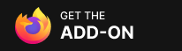

<p align="center">
  
</p>

<h1 align="center">Downlink</h1>

<p align="center">
  简体中文 · <a href="./README.en.md">English</a>
</p>

<p align="center">
  <a href="https://github.com/007ayong/Downlink/stargazers">
    
  </a>
  <a href="https://github.com/007ayong/Downlink/releases">
    
  </a>
  <a href="./LICENSE">
    
  </a>
</p>


Downlink 是一个用于对接多线程下载器的浏览器扩展，在浏览器确认下载响应后接管任务，并发送到你选择的外部下载器。

它支持接入多种下载器，并可在设置中随时切换，无需安装多个扩展。一个插件即可完成下载接管、网页媒体捕获、任务状态查看、媒体预览和右键快捷发送，兼容 Chromium 内核浏览器（Chrome / Edge）、Firefox 与 Safari。


## 截图


## 当前支持

- [Aria2](https://github.com/aria2/aria2)
- [Motrix](https://github.com/agalwood/motrix)
- [MotrixNext](https://github.com/AnInsomniacy/motrix-next)
- [Gopeed](https://github.com/GopeedLab/gopeed)
- [AB DM](https://github.com/amir1376/ab-download-manager)
- [Neat Download Manager](https://www.neatdownloadmanager.com/index.php/en/)

## 主要功能

- **下载接管**：在浏览器确认下载响应后接管任务，转交给当前配置的下载器；也支持通过弹窗或右键菜单手动发送
- **多下载器切换**：内置 Aria2、Motrix、MotrixNext、Gopeed、AB DM、NeatDM 适配器，设置中一键切换
- **智能识别**：按扩展名和响应类型识别常见文件下载；可配置低于大小阈值的小文件保留给浏览器下载，减少下载器任务噪音
- **媒体捕获**：监听页面中的音频、视频请求，在媒体面板中展示、预览并发送到下载器
- **请求头透传**：透传 Cookie、Referer、鉴权头等关键请求头，改善需要登录态或防盗链校验的下载场景
- **任务管理**：弹窗中查看任务列表和待确认任务；Aria2 支持独立任务管理页，可查看进度、暂停/继续、限速
- **错误提醒与连接测试**：发送失败时通过通知提醒，并提供基础连接检测
- **快捷键**：默认 `Ctrl+Shift+D`（macOS 为 `MacCtrl+Shift+D`）快速切换自动拦截

## 安装方式

### 商店安装

[](https://chromewebstore.google.com/detail/eepjgbffnmmhpinlmlncdfnhjccpigcg)
[](https://microsoftedge.microsoft.com/addons/detail/klkhmcdcnnhggpiipgedlafhpobojpgl)
[](https://addons.mozilla.org/zh-CN/firefox/addon/downlink/)

各商店已发布版本：

| 商店 | 版本 |
| --- | --- |
| [Chrome Web Store](https://chromewebstore.google.com/detail/eepjgbffnmmhpinlmlncdfnhjccpigcg) |  |
| [Edge Add-ons](https://microsoftedge.microsoft.com/addons/detail/klkhmcdcnnhggpiipgedlafhpobojpgl) |  |
| [Firefox Add-ons](https://addons.mozilla.org/zh-CN/firefox/addon/downlink/) |  |

### 本地加载（开发模式）

Chromium 内核浏览器（Chrome / Edge）：

1. 打开扩展管理页面（`chrome://extensions` 或 `edge://extensions`）
2. 开启“开发者模式”
3. 点击“加载已解压的扩展程序”，选择 `dist/chromium` 目录（或项目根目录）

Firefox：

1. 打开 `about:debugging#/runtime/this-firefox`
2. 点击“临时载入附加组件”
3. 选择 `dist/firefox/manifest.json`

## 构建

构建需要 Node.js 20+ 和 `zip` 命令行工具；项目没有第三方 npm 依赖，无需执行 `npm install`。

### 打包命令

```bash
npm run package:chromium   # 产物：dist/downlink-vX.Y.Z-chromium.zip
npm run package:firefox    # 产物：dist/downlink-vX.Y.Z-firefox.zip
npm run package:all        # 同时构建 Chromium 与 Firefox
```

开发模式使用 watch 构建，改动后自动重新生成，不产出 zip：

```bash
npm run dev                # 同时监听 Chromium 与 Firefox
npm run dev:chromium       # 仅 Chromium，输出到 dist/chromium
npm run dev:firefox        # 仅 Firefox，输出到 dist/firefox
```

### Firefox 附加组件 ID

Firefox 打包默认使用自托管 ID `downlink@winapps.cc`。如需打包 AMO 商店版，指定另一个 ID 以避免冲突：

```bash
FIREFOX_ADDON_ID="downlink-amo@winapps.cc" npm run package:firefox
```

Firefox 构建版会自动添加 `webRequestBlocking` 权限，并将主机权限收窄到 http/https 与本地回环地址（详见“权限说明”）。

### Safari / macOS 构建

本地构建 Safari Web Extension 宿主 App：

```bash
npm run safari:build
```

该命令会先执行 `safari:check` 校验共享资源与版本一致性，再使用 Xcode 构建 Release 版本。需要可用的 Apple 签名配置；如只需验证工程能否编译，可禁用代码签名：

```bash
CODE_SIGNING_ALLOWED=NO npm run safari:build
```

Safari 工程位于 `safari/Downlink/Downlink.xcodeproj`，构建产物目录为 `dist/safari/DerivedData`。

## 脚本

### npm 脚本

| 命令 | 说明 |
| --- | --- |
| `npm test` | 运行测试（`node --test`） |
| `npm run dev` | 同时监听构建 Chromium 与 Firefox（不生成 zip） |
| `npm run dev:chromium` | 仅监听构建 Chromium，输出 `dist/chromium` |
| `npm run dev:firefox` | 仅监听构建 Firefox，输出 `dist/firefox` |
| `npm run package:release` / `package:all` | 同时打包 Chromium 与 Firefox 的 zip |
| `npm run package:chromium` | 打包 Chromium zip |
| `npm run package:firefox` | 打包 Firefox zip |
| `npm run safari:sync` | 将共享扩展资源同步到 Safari 工程，并同步各端版本号 |
| `npm run safari:check` | 只读预检：检查 Safari 资源与版本是否漂移 |
| `npm run safari:build` | 预检通过后执行 Xcode Release 构建 |

### 同步脚本

- `npm run safari:sync`：把根目录的共享资源（脚本、页面、图标、语言包等）复制到 `safari/Downlink/Downlink Extension/Resources`，同步 `manifest.json`、`package.json`、Safari manifest 与 Xcode 工程中的版本号，并确保 Safari 的 JavaScript 文件带 UTF-8 BOM。Safari 专属文件不会被覆盖。
- `npm run safari:check`：只读检查以上内容是否一致，供 CI 或发布前使用；有漂移时提示运行 `npm run safari:sync` 修复。
- `node scripts/sync-versions.mjs --check`：单独检查各端版本号是否与根 `manifest.json` 一致。
- `node scripts/generate-firefox-update-manifest.mjs <xpi路径> <输出路径>`：为 Firefox 自托管生成 `updates.json` 更新清单（含 SHA-256 哈希），由 GitHub Release 工作流调用。

## 自动发布

仓库拆分为 4 个独立工作流：

| 工作流 | 触发方式 | 说明 |
| --- | --- | --- |
| GitHub Release | 推送 `v*` tag | 运行测试并打包上传 Chromium 包到 Release，随后签名 Firefox 自托管 XPI 并一并上传 |
| Publish to Chrome Web Store | 手动触发（输入 tag 或 commit） | 按指定 ref 打包并提交 Chrome Web Store |
| Publish to Edge Add-ons | 手动触发（输入 tag） | 按指定 tag 打包并提交 Edge Add-ons |
| Publish to Firefox Add-ons | 手动触发（输入 tag 或 commit，可附审核备注） | 按指定 ref 打包并以 AMO 公开上架（listed）渠道提交 |

`GitHub Release` 除 Chromium 包外，还会上传 Firefox 自托管更新文件：

- `downlink-vX.Y.Z-firefox.xpi`
- `downlink-firefox-updates.json`

发布前需要在 GitHub Secrets 中配置：

- `CHROME_PUBLISHER_ID`
- `CHROME_EXTENSION_ID`
- `CHROME_SERVICE_ACCOUNT_JSON`
- `EDGE_PRODUCT_ID`
- `EDGE_CLIENT_ID`
- `EDGE_API_KEY`
- `AMO_JWT_ISSUER`
- `AMO_JWT_SECRET`

可通过 GitHub Variables 配置 `FIREFOX_LISTED_ADDON_ID` 覆盖 Firefox 商店版的附加组件 ID，默认值为 `downlink-amo@winapps.cc`。

tag 版本必须与 `manifest.json` 中的 `version` 一致，例如 tag `v1.3.10` 对应 `manifest.json` 中的 `1.3.10`。

## 基本使用

1. 点击扩展图标打开 Downlink
2. 在“设置”中选择目标下载器
3. 根据所选下载器填写连接信息
4. 打开“自动拦截下载”后，浏览器确认的下载响应会按规则自动转交
5. 如需手动发送，可通过弹窗中的任务区、媒体区或右键菜单操作

## 下载器配置说明

### Aria2 RPC

需要填写：

- RPC 地址
- RPC 密钥，可留空

适合本地或远程运行 `aria2c` 或 Motrix，并开启 RPC 的场景。
如果你同时安装了 MotrixNext，可勾选“使用 MotrixNext 管理”，在任务面板中快速打开查看。

### MotrixNext

需要填写：

- 端口号
- 密钥，可留空。留空表示 MotrixNext 的 `extensionApiSecret` 未配置，此时 HTTP API 不启用鉴权，连接检测仍会成功。

Downlink 会直接向本机 MotrixNext HTTP 接收服务发送 `POST /add`，请求体格式为 `{ "url": "...", "filename": "...", "referer": "...", "cookie": "..." }`。`filename` 会在浏览器捕获或媒体面板识别到文件名时附带，`referer` 和 `cookie` 会在浏览器捕获到相关请求头时附带。MotrixNext 模式不使用扩展侧的二次确认、暂停/继续或进度控制。

### Gopeed

需要填写：

- API 地址，默认 `http://127.0.0.1:9999`
- Token，可留空

Downlink 会通过 Gopeed HTTP API 发送 `POST /api/v1/tasks`。浏览器拦截到的普通下载默认会先进入确认面板；如需自动开始下载，可在设置中开启“普通任务静默下载”。只有在确认面板勾选“单线程不分片下载”时才会传递 `opts.extra.connections = 1`，否则不传递连接数参数。扩展不会向 Gopeed 指定保存路径，由 Gopeed 端控制下载位置。

### AB DM

需要填写：

- 服务地址
- 端口号

一般情况下，需要核实软件本体和该扩展中的端口号是否一致。
普通任务默认通过 `/add` 添加；如需普通任务静默开始下载，可在设置中开启对应选项。媒体资源会固定使用 `/start-headless-download`，以保证视频文件名正确。浏览器拦截和右键菜单都会直接发送到 AB DM，不经过扩展的确认面板。

### NeatDM

当前通过默认 WebSocket 地址连接：

- `ws://127.0.0.1:10007/download`

适合本地已运行 NeatDM 接收服务的场景。Neat Download Manager 不开放端口配置。
浏览器拦截和右键菜单都会直接发送到 NeatDM，不经过扩展的确认面板。

## 媒体捕获

Downlink 会监听页面中的音频和视频请求，并在媒体面板中展示可发送资源。对于部分依赖请求头、Cookie 或防盗链校验的资源，扩展会尽量补齐请求头以提升可下载性和可预览性。

## 权限说明

Chromium 构建（Chrome / Edge）当前使用的权限来自根目录 `manifest.json`：

- `downloads`：接管浏览器确认的下载任务，处理文件名与下载事件
- `storage`：保存扩展设置（同步/本地存储）
- `notifications`：下载或连接失败时弹出提醒
- `tabs`：获取来源标签页、打开下载器管理页面、跟踪任务状态
- `webRequest`：识别下载响应、捕获 Cookie / Referer / 鉴权头等关键请求头
- `contextMenus`：右键菜单“用当前下载器下载”
- `declarativeNetRequest`：为媒体预览与元数据探测请求临时补头（会话级规则，不持久化）
- 主机权限 `<all_urls>`：匹配任意站点的请求，用于下载识别与媒体捕获

Firefox 构建版由打包脚本自动调整：

- 额外添加 `webRequestBlocking`，用于在 Firefox 中拦截和取消请求
- 主机权限收窄为 `http://*/*`、`https://*/*`、`*://127.0.0.1/*`、`*://localhost/*` 及对应的 `ws://` 地址

Safari 工程使用独立的清单 `safari/Downlink/Downlink Extension/Resources/manifest.json`，权限集合与 Chromium 版略有差异（包含 `nativeMessaging`、`scripting`、`cookies`、`webNavigation` 等 Safari 所需权限），以该文件为准。

## 项目结构

- `manifest.json`：扩展清单（Chromium / Firefox 共用，打包时按目标调整）
- `background.js`：后台逻辑、下载转发、请求捕获
- `content-script.js`：页面注入脚本
- `popup.html` / `popup.js` / `popup-app.js`：扩展弹窗 UI
- `preview.html` / `preview.js`：媒体预览页面
- `aria2-tasks.html` / `aria2-tasks.js`：Aria2 任务管理页
- `lib/`：配置默认值、下载器适配、媒体捕获、i18n 等共享模块
- `scripts/`：打包、同步、版本校验与发布脚本
- `safari/`：Safari Web Extension 宿主工程
- `icons/`：扩展图标

## 许可证

本项目采用 [GNU General Public License v3.0 only](./LICENSE)。
