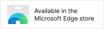

# Downlink

GitHub 仓库：[Downlink](https://github.com/007ayong/Downlink)

Downlink 是一个浏览器扩展，用来在浏览器确认下载响应后接管任务，并发送到你选择的外部下载器。

该扩展支持接入多种下载器，拥有高度的灵活性，可根据你使用的下载器，在设置中自行切换保存。只需一个浏览器插件，即可完成下载接管、网页媒体捕获和基础状态查看。

## 截图

## 当前支持

- [Aria2](https://github.com/aria2/aria2)
- [Motrix](https://github.com/agalwood/motrix)
- [MotrixNext](https://github.com/AnInsomniacy/motrix-next)
- [Gopeed](https://github.com/GopeedLab/gopeed)
- [AB DM](https://github.com/amir1376/ab-download-manager)
- [Neat Download Manager](https://www.neatdownloadmanager.com/index.php/en/)

## 主要功能

- 在浏览器确认下载响应后接管任务，并转交给当前配置的下载器
- 支持按扩展名和响应类型识别常见文件下载
- 可选择让已知大小低于阈值的小文件保留浏览器下载，减少下载器任务噪音
- 支持根据响应类型捕获音频、视频等媒体资源
- 支持在弹窗中查看任务列表和待确认任务
- 支持预览已捕获的媒体资源，并发送到下载器
- 支持透传关键请求头，改善需要 Cookie、Referer 或鉴权头的下载场景
- 支持错误提醒和基础连接测试

## 安装方式

打开 Chromium 内核浏览器的扩展管理页面，开启“开发者模式”，然后选择“加载已解压的扩展程序”，指定当前项目目录即可。

## 商店地址

## 自动发布

仓库现在拆成了 3 个独立工作流：

- `GitHub Release`：推送 `v*` 格式的 tag 时自动生成压缩包并上传 Release
- `Publish to Edge Add-ons`：推送 `v*` 格式的 tag 时自动提交到 Edge
- `Publish to Chrome Web Store`：手动触发，使用你指定的 tag 或 commit

发布前需要在 GitHub Secrets 中配置：

- `CHROME_PUBLISHER_ID`
- `CHROME_EXTENSION_ID`
- `CHROME_SERVICE_ACCOUNT_JSON`
- `EDGE_PRODUCT_ID`
- `EDGE_CLIENT_ID`
- `EDGE_API_KEY`

tag 版本需要和 `manifest.json` 里的 `version` 保持一致，例如 `v1.0.3` 对应 `manifest.json` 中的 `1.0.3`。

## 基本使用

1. 点击扩展图标打开 Downlink
2. 在“设置”中选择目标下载器
3. 根据所选下载器填写连接信息
4. 打开“自动拦截下载”后，浏览器确认的下载响应会按规则自动转交
5. 如需手动发送，可通过弹窗中的任务区、媒体区或右键菜单操作

## 下载器配置说明

### Aria2 RPC

需要填写：

- RPC 地址
- RPC 密钥，可留空
- 默认保存目录，可留空

适合本地或远程运行 `aria2c` 或 Motrix，并开启 RPC 的场景。
如果你同时安装了 MotrixNext，可勾选“使用 MotrixNext 管理”，在任务面板中快速打开查看。

### MotrixNext

需要填写：

- 端口号
- 密钥，可留空。留空表示 MotrixNext 的 `extensionApiSecret` 未配置，此时 HTTP API 不启用鉴权，连接检测仍会成功。

Downlink 会直接向本机 MotrixNext HTTP 接收服务发送 `POST /add`，请求体格式为 `{ "url": "...", "filename": "...", "referer": "...", "cookie": "..." }`。`filename` 会在浏览器捕获或媒体面板识别到文件名时附带，`referer` 和 `cookie` 会在浏览器捕获到相关请求头时附带。MotrixNext 模式不使用扩展侧的二次确认、暂停/继续或进度控制。

### Gopeed

需要填写：

- API 地址，默认 `http://127.0.0.1:9999`
- Token，可留空

Downlink 会通过 Gopeed HTTP API 发送 `POST /api/v1/tasks`。浏览器拦截到的普通下载会先进入确认面板；只有在确认面板勾选“单线程不分片下载”时才会传递 `opts.extra.connections = 1`，否则不传递连接数参数。扩展不会向 Gopeed 指定保存路径，由 Gopeed 端控制下载位置。

### AB DM

需要填写：

- 服务地址
- 端口号

一般情况下，需要核实软件本体和该扩展中的端口号是否一致。
普通任务默认通过 `/add` 添加；如需普通任务静默开始下载，可在设置中开启对应选项。媒体资源会固定使用 `/start-headless-download`，以保证视频文件名正确。

### NeatDM

当前通过默认 WebSocket 地址连接：

- `ws://127.0.0.1:10007/download`

适合本地已运行 NeatDM 接收服务的场景。Neat DM 不开放端口配置。

## 媒体捕获

Downlink 会监听页面中的音频和视频请求，并在媒体面板中展示可发送资源。对于部分依赖请求头、Cookie 或防盗链校验的资源，扩展会尽量补齐请求头以提升可下载性和可预览性。

## 权限说明

扩展当前使用的权限包括：

- `downloads`
- `storage`
- `notifications`
- `tabs`
- `webRequest`
- `contextMenus`
- `declarativeNetRequest`
- `<all_urls>` 主机权限

这些权限主要用于下载接管、请求识别、媒体捕获、状态展示和右键菜单操作。

## 项目结构

- `manifest.json`：扩展清单
- `background.js`：后台逻辑、下载转发、请求捕获
- `popup.html` / `popup.js`：扩展弹窗 UI
- `preview.html` / `preview.js`：媒体预览页面
- `icons/`：扩展图标

## 许可证

本项目采用 [GNU General Public License v3.0 only](./LICENSE)。
